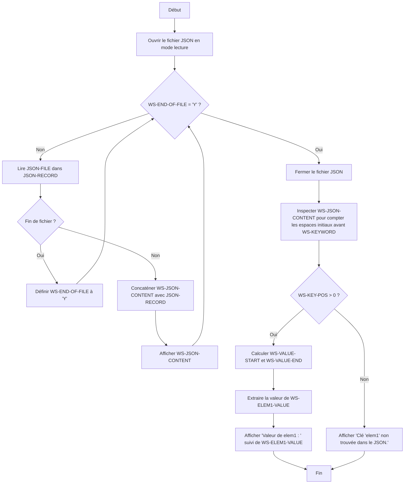

# 01 - Parser un JSON

## Introduction

Cet exercice a pour objectif de démontrer comment utiliser COBOL pour manipuler des données structurées au format JSON. En travaillant sur cet exemple, vous apprendrez à :

- Lire et analyser un fichier JSON.
- Extraire et afficher les informations contenues dans ce fichier.
- Identifier les limites et les adaptations nécessaires pour traiter des données JSON avec COBOL.

## Structure du Dossier

Le dossier est organisé comme suit :

``` sh
01 - Parser un JSON
├── README.md          # Ce fichier
├── run.sh             # Script pour exécuter l'exercice
└── src
    ├── data.json      # Exemple de fichier JSON
    └── parser.cob     # Programme COBOL pour parser le JSON
```

### Détails des fichiers

- **`README.md`** : Documentation de l'exercice.
- **`run.sh`** : Script shell pour exécuter le programme COBOL.
- **`data.json`** : Exemple de fichier JSON contenant des données structurées.
- **`parser.cob`** : Code COBOL conçu pour lire et analyser le contenu du fichier JSON.

## Instructions

1. **Préparation de l'environnement**
   - Assurez-vous d'avoir un compilateur COBOL installé (par exemple, GnuCOBOL).

2. **Exécution du script**
   - Lancez le script `run.sh` pour compiler et exécuter le programme :

     ```bash
     ./run.sh
     ```

3. **Analyse du code**
   - Consultez le fichier `parser.cob` pour comprendre les techniques utilisées pour lire et traiter un fichier JSON avec COBOL.

4. **Personnalisation**
   - Modifiez le fichier `data.json` pour tester le programme avec vos propres données.

## Objectifs d'Apprentissage

À travers cet exercice, vous développerez les compétences suivantes :

- Maîtriser les bases de l'interaction entre COBOL et des formats de données modernes tels que JSON.
- Adapter un programme COBOL pour gérer des structures de données complexes.
- Approfondir les concepts de parsing et de gestion des données en COBOL.

## Annalyse personnel

C'est ici que seront détaillé l'ensemble de mes observations pour cet exercice.

### Fonctionnement de la procedure division

Le fonctionnement de base est de déterminer la position de début de la variable et la longeur de la variable



## Ressources Supplémentaires

Pour approfondir vos connaissances :

- [GnuCOBOL User Guide](https://gnucobol.sourceforge.io/)
- [JSON.org](https://www.json.org/)

---

Si vous avez des questions ou si vous rencontrez des problèmes, n'hésitez pas à ouvrir une issue dans le dépôt principal.
