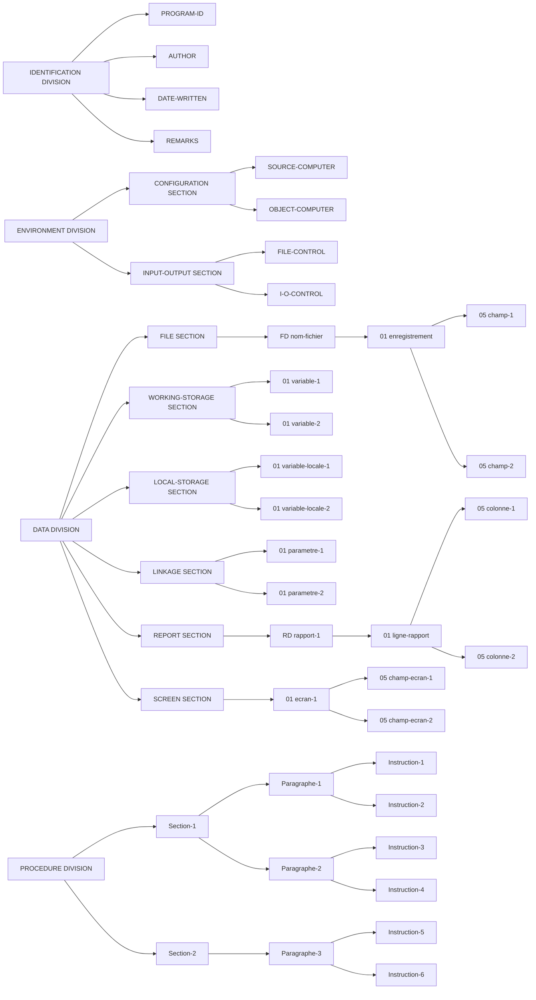

# Cobol

Je vais mettre ici mes observation générals sur le foncitonnement de COBOL.

# Sommaire

- [Cobol](#cobol)
- [Sommaire](#sommaire)
  - [Variables](#variables)
  - [Structure d'un programme COBOL](#structure-dun-programme-cobol)
    - [Division](#division)
      - [Identification](#identification)
      - [Environnement](#environnement)
        - [File-Controle](#file-controle)
      - [Data](#data)
        - [File-Section](#file-section)
      - [Procedure](#procedure)
        - [Perform](#perform)
        - [Inspect](#inspect)

## Variables

Comment on déclare des variables, déclarées dans la `DATA DIVISION`, spécifiquement dans la `WORKING-STORAGE SECTION` pour les variables temporaires. La déclaration suit une structure précise qui définit le type, la taille et, éventuellement, la valeur initiale de la variable.

```cobol
niveau nom-de-variable PIC image [VALUE valeur-initiale].
```

- **Niveau**: Indique la hiérarchie de la variable. Les niveaux couramment utilisés sont :
  - `01` à `49` : Pour les variables simples ou les structures imbriquées.
  - `77` : Pour les variables simples non structurées.
  - `88` : pour les bool
- **Nom de la variable**: Identifiant unique de la variable, composé de lettres, chiffres et du tiret (-). Le nom doit commencer par une lettre.
- **PIC** (Picture) : Spécifie le type et la taille de la variable :
  - `9` : Caractère numérique (0-9).
  - `X` : Caractère alphanumérique (lettres, chiffres, symboles).
  - `A` : Caractère alphabétique (lettres uniquement).
  - `S` : Indique un signe pour les nombres (positif ou négatif).
  - `V` : Position implicite de la virgule décimale.
- **VALUE**: Facultatif. Définit la valeur initiale de la variable.

Exemple

```cobol
77  age PIC 9(2) VALUE 25.
77  nom PIC X(20) VALUE "Dupont".
77  salaire PIC S9(5)V99 VALUE 1234.56.
88  bool VALUE TRUE.

01  personne.
    05  nom        PIC X(20).
    05  prenom     PIC X(20).
    05  adresse.
        10  rue    PIC X(50).
        10  ville  PIC X(30).
        10  code   PIC X(10).
```

Déclare une variable salaire de type numérique signé avec 5 chiffres avant la virgule et 2 après, initialisée à 1234,56.

- `ZERO`, `ZEROS`, `ZEROES` : Zéro numérique.
- `SPACE`, `SPACES` : Espace(s) blanc(s).
- `HIGH-VALUE`, `HIGH-VALUES`: Valeur la plus élevée dans la collatération.
- `LOW-VALUE`, `LOW-VALUES`: Valeur la plus basse dans la collatération.
- `QUOTE`, `QUOTES`: Guillemet(s) (").

## Structure d'un programme COBOL



### Division

Un programme COBOL utilise obligatoirement 4 blocs `division` pour ce structurer :

- `identification` Carte d'identité du programme
- `environement` liens avec les autres programmes
- `data` structure de la donnée propre à ce fichier
- `procedure` programme/fonction

```cobol
IDENTIFICATION DIVISION.
PROGRAM-ID. MonProgramme.
AUTHOR. Champémont Mathurin.

ENVIRONMENT DIVISION.
INPUT-OUTPUT SECTION.
FILE-CONTROL.
    SELECT MonFichier ASSIGN TO 'fichier.txt'.

DATA DIVISION.
WORKING-STORAGE SECTION.
01 MaVariable PIC 9(5) VALUE 0.

PROCEDURE DIVISION.
    DISPLAY "Bonjour, COBOL !".
    STOP RUN.
```

Chaque division à des sections (sous section quoi) :

#### Identification

Aucune section.

#### Environnement

- `CONFIGURATION SECTION` : Spécifie l'environnement matériel ou logiciel.
- `INPUT-OUTPUT SECTION` : Définit les fichiers utilisés dans le programme.

##### File-Controle

C'est dans le `INPUT-OUTPUT SECTION`, ça permet de définir les fichier externe et comment ils seront gérés par le programme.

```cobol
FILE-CONTROL.
    SELECT nom-logique
        ASSIGN TO "chemin-ou-périphérique-du-fichier"
        ORGANIZATION IS SEQUENTIAL
        ACCESS MODE IS SEQUENTIAL
```

Commence toujours par un `SELECT`.

- `SELECT` : Associe un nom de fichier logique à un fichier physique.
- `ASSIGN TO` : Spécifie le nom du fichier physique ou le périphérique.
- `ORGANIZATION IS` : Définit l'organisation du fichier
  - `SEQUENTIAL` : Les enregistrements sont stockés et accédés dans l'ordre dans lequel ils ont été écrits. Chaque enregistrement a un prédécesseur et un successeur uniques, sauf le premier et le dernier. Cette organisation est simple et efficace pour un traitement linéaire des données.
  - `INDEXED` : Chaque enregistrement contient une clé unique qui sert d'index. Les enregistrements peuvent être accédés séquentiellement ou directement via leur clé. Cette organisation est idéale pour les fichiers nécessitant des recherches rapides basées sur des clés spécifiques.
  - `RELATIVE` : Les enregistrements sont identifiés par un numéro relatif indiquant leur position par rapport au début du fichier. Cela permet un accès direct aux enregistrements en utilisant leur numéro relatif, offrant une flexibilité entre l'accès séquentiel et direct.
- `ACCESS MODE IS` : Indique le mode d'accès
  - `SEQUENTIAL` : Les enregistrements sont lus ou écrits dans l'ordre, un par un, tel qu'ils apparaissent dans le fichier. Ce mode est adapté lorsque tous les enregistrements doivent être traités dans une séquence définie.
  - `RANDOM` : Permet d'accéder directement à un enregistrement spécifique en utilisant une clé ou un numéro relatif, sans parcourir les enregistrements précédents. Ce mode est utile lorsque seuls certains enregistrements spécifiques doivent être accédés ou mis à jour.
  - `DYNAMIC` : Combine les modes séquentiel et aléatoire, permettant au programme de basculer entre les deux selon les besoins. Par exemple, un programme peut lire des enregistrements séquentiellement, puis accéder directement à un enregistrement spécifique, puis reprendre la lecture séquentielle.
- `RECORD KEY IS` : Pour les fichiers indexés, spécifie la clé de l'enregistrement.
- `FILE STATUS IS` : Assigne une variable pour capturer le code de statut des opérations sur le fichier.

[source](https://www.mcours.net/cours/pdf/info/COBOL_Gestion_de_fichier.pdf)
[acces mode](https://www.mainframestechhelp.com/tutorials/cobol/file-access-modes.htm)

#### Data

Peux contenir les sections suivantes :

- `FILE SECTION` : Déclare les structures des fichiers.
- `WORKING-STORAGE SECTION` : Définit des variables temporaires globales.
- `LOCAL-STORAGE SECTION` : Définit des variables locales initialisées à chaque invocation.
- `LINKAGE SECTION` : Définit les variables reçues en paramètres.
- `REPORT SECTION` : Déclare les structures pour les rapports (rarement utilisée).
  
##### File-Section

```cobol
FD  JSON-FILE.
01  JSON-RECORD   PIC X(1000).
```

`FD` pour File Description. Cette entrée spécifie les caractéristiques du fichier, telles que son organisation, sa longueur de registre et d'autres attributs pertinents.

`01` pour dire que c'est un enregistrement de niveau supérieur. `PIC X(1000)` Champs alphanumérique de 1000 char.

#### Procedure

- Pas de sections prédéfinies.
- Organisation possible en sections et paragraphes pour structurer les instructions.

Organisation level :

- `Sections` : Unités logiques regroupant des paragraphes. Chaque section commence par un nom suivi du mot-clé SECTION.
- `Paragraphes` : Sous-unités au sein des sections, identifiées par un nom de paragraphe. Un paragraphe peut contenir une ou plusieurs phrases.
- `Phrases` : Ensembles d'instructions se terminant par un point (.).
- `Instructions` : Commandes individuelles exécutées par le programme, telles que MOVE, ADD, PERFORM, etc.

```cobol
PROCEDURE DIVISION.
    Section-1 SECTION.
        Paragraphe-1.
            Instruction-1.
            Instruction-2.
        Paragraphe-2.
            Instruction-3.
    Section-2 SECTION.
        Paragraphe-3.
            Instruction-4.
```

[source IBM](https://www.ibmmainframer.com/cobol-tutorial/cobol-procedure-division/)

##### Perform

Appel une section de procedure

##### Inspect

```cobol
INSPECT {identifiant-1}
    {TALLYING {identifiant-2} FOR {ALL | LEADING} {caractère | chaîne}}
    {REPLACING {ALL | LEADING | CHARACTERS} {caractère | chaîne} BY {caractère | chaîne}}
    {CONVERTING {caractères-source} TO {caractères-cible}}
    {BEFORE | AFTER INITIAL {caractère | chaîne}}
```

[vidéo aide](https://youtu.be/L0ETvEdEb8o)

Options de l'Instruction INSPECT :

- `TALLYING` : Compte les occurrences d'un caractère ou d'une chaîne dans l'élément de données spécifié.
  - `ALL` : Compte toutes les occurrences.
  - `LEADING` : Compte les occurrences contiguës à partir du début.
- `REPLACING` : Remplace des caractères ou des chaînes spécifiques dans l'élément de données.
  - `ALL` : Remplace toutes les occurrences.
  - `LEADING` : Remplace les occurrences contiguës à partir du début.
  - `CHARACTERS` : Remplace chaque caractère individuellement.
- `CONVERTING` : Convertit des caractères spécifiques en d'autres caractères correspondants.
- `BEFORE` | `AFTER INITIAL` : Limite l'opération à la partie de la chaîne avant ou après la première occurrence d'un caractère ou d'une chaîne spécifique.
